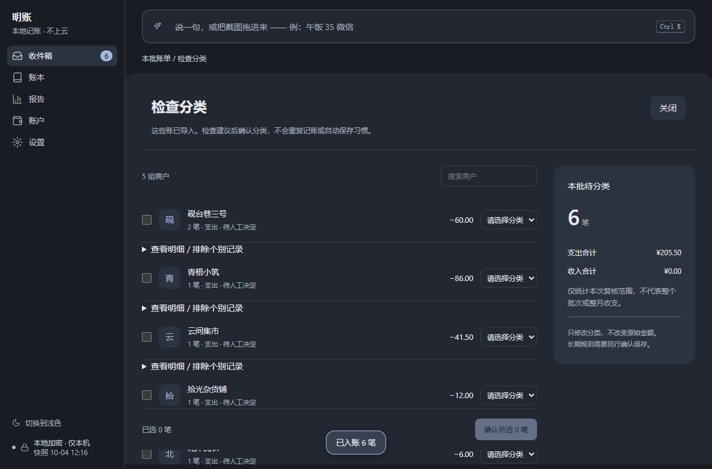
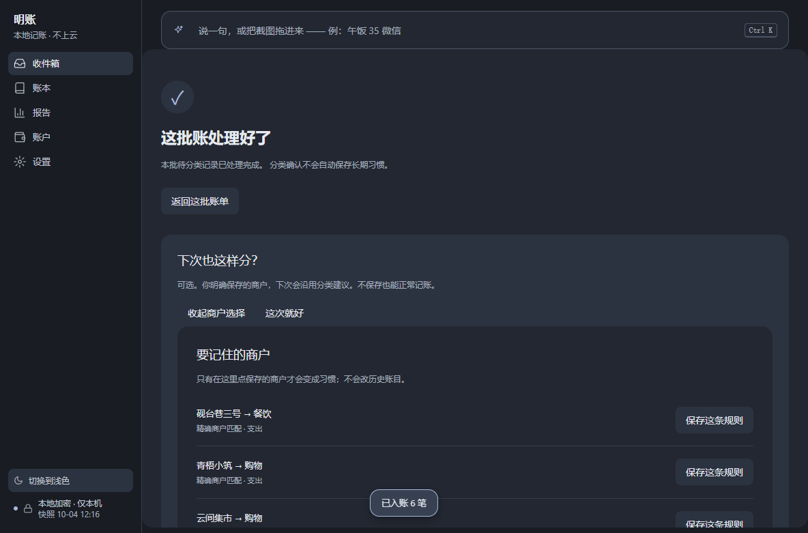
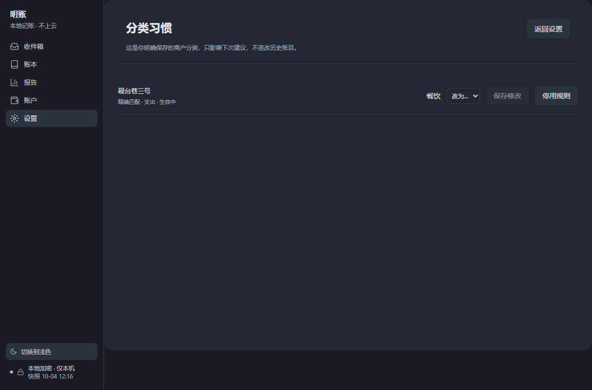

# 明账 · MingZhang

**本地优先的 AI 记账桌面应用（Windows）**：把一句话或一张截图丢进来，AI 负责解析、反问、记住习惯；账本全量加密，只存本机。

> A local-first, AI-native expense tracker for Windows.
> One sentence or one screenshot in — the AI parses it, asks back when unsure, and the ledger never leaves your machine.

截图（离线演示模式 + Playwright 驱动真实 Electron 窗口实拍，非设计稿）：







## 为什么做这个

记账应用的通病是「记一笔」本身太贵：打开 → 选分类 → 填金额 → 保存。四步起步，坚持两周就断了。

明账把入口压到**一句话**或**一张截图**：判断交给模型，习惯交给你**明确保存**的商户规则（"以后星巴克都算咖啡"），月底由它来问你——而不是你追着它看。

界面是**收件箱 + 账本 + 报告 + 账户 + 助手面板**：待确认的账在收件箱排队，你逐笔过目；助手面板常驻右侧，随时问、随时让它归类。

## 导入之后：检查分类，再确认

整批导入账单是主要用法，所以**导入完成不等于结束**——账进来了，分类还没准。导入后：

1. **检查**：待分类的账按商户分组列出，可靠的建议已填好，拿不准的留白等你决定（可逐笔排除、可只确认一部分）；
2. **确认前不动账**：只把选中的记录落成分类；这个过程中途关掉也不丢，重开接着检查，已确认的部分不会被重复覆盖；
3. **结果**：给一页这次确认了什么，可以撤销；撤销只回退这次分类，不碰你另外保存的习惯；
4. **可选记住**：只有你点了「下次也这样分」，才会把该商户的分类存成习惯——**默认什么都不记住**。

习惯（原「分类规则」）集中在 **设置 → 分类习惯**：看得到、能逐条停用，只影响下次建议，不追改历史账目。

## 三个设计决定

### 一、安全做在能力面，不做在半吊子沙盒里

嵌进去的 agent 引擎**没有 bash、没有任意文件读写、没有网页访问**——工具面只有 16 条账务动作。

危险动作（删除、批量入账）必须由 **UI 按钮**放行：模型自己说"用户已确认"不算数——顺带堵住 prompt injection。

出网只有你自己配置的模型 API。但要分清楚两件事：**账本文件不上传**，而你为了让模型解析的那部分内容（一句话、截图、账单里需要判断的取值）会**发给你配置的那个供应方**——它留存不留存、留多久，由它的政策决定，明账管不了。本地加密只保证文件在你机器上是加密的，**不等于发给模型的材料没出过本机**。不想有任何出网，就用下面的离线演示模式。

### 二、AI 判断，程序搬运

把整张 CSV/XLSX 塞给模型逐行重述金额，是记账工具不能接受的失效模式——**抄错一位数字，你无从发现**。

所以分工线画在「判断 vs 搬运」上，而不是"AI 用得多还是少"：

- **归 AI**：这列是什么、哪些行不算账、列取值怎么映射成收支方向与账户、分类给什么
- **归程序**：每行的金额与日期解析、去重、笔数对账、落库——**数字和行数一律不经模型输出**
- **程序不猜**：方案没覆盖到的取值 → 整批退回并列出清单；不静默归类、不落默认账户、不虚构时间

### 三、硬对账不变量

一次导入必须满足：`消费行数 = 将入账 + 重复跳过 + 待核对 + 不计收支`。

不相等就整体回滚报错——不会出现"导了一半"的账。

## 技术栈

| | |
|---|---|
| 壳 | Electron 44 + electron-vite（main / preload / renderer 三进程） |
| 界面 | React 18 + TypeScript 5.7 |
| Agent 引擎 | pi（`@earendil-works/pi-coding-agent`）作为 SDK 嵌入，工具面收窄到账务动作 |
| 存储 | 加密 SQLite（better-sqlite3-multiple-ciphers）；密钥走 Electron safeStorage（Windows DPAPI） |
| 规模 | 约 3.2 万行 TypeScript（其中测试 1.29 万行）：主进程 9.5k / 渲染层 9.0k / 共享 0.6k |
| 依赖 | 运行时 7 个、开发 11 个（无 UI 组件库、无图表库） |

## 跑起来

前置：**Node ≥ 22.12**（Electron 44 的要求）、Windows。

```bash
npm install
npm run dev
```

**不配模型也能完整跑一遍**：打开应用 → 点「先开离线演示」→ 输入框里说「麦当劳 26」回车 → 出账卡片。

离线演示是内置的**确定性假模型**（在本机 127.0.0.1 起一个 OpenAI 兼容端点，按规则解析并产出工具调用）：不联网、零成本、逐字可复现，也是下面 UI 巡检的底座。

## 测试

```bash
npm run typecheck   # 类型检查（main + web 双工程，零输出通过）
npm test            # 359 条单测（vitest，38 个文件）
npm run ui-test     # 78 条 UI 巡检（Playwright 驱动真实 Electron 窗口）
npm run dist        # 出包 → release/mingzhang-0.1.0-x64.exe（NSIS）+ .zip（便携）
```

UI 巡检跑的是**真窗口、真 IPC**，不是组件快照；数据目录经 `MZ_DATA_DIR` 指向临时目录，不会碰你本机的账本。

## 数据与隐私

- 账本 = 本机一个**加密** SQLite 文件，默认在 `%APPDATA%\mingzhang`；程序目录旁存在可写 `data/` 时自动切**便携模式**
- **没有账号、没有云同步、没有遥测**；出网只有你自己配置的模型供应商
- API Key 走系统安全存储，**永不进日志 / 崩溃报告 / 导出 / 备份**，也不随备份迁移（换机重填）
- 只读你选中的附件，不碰其他文件

## 已知限制

- 仅 Windows（NSIS 安装版 + zip 便携版）
- 版本 0.1.0：日常可用；**账户屏仍在实现中**（当前为占位页），数据 schema 与工具面仍可能变
- 「下次也这样分」的保存请求不跨页面续传：中途关掉页面后再点一次，算一次**新的**保存意图（不复用上一次的请求）
- 安装包未做代码签名，Windows SmartScreen 会提示一次
- 图片走多模态直读，主模型需支持视觉（无本地 OCR 兜底）

## 许可

MIT，见 [LICENSE](LICENSE)。
