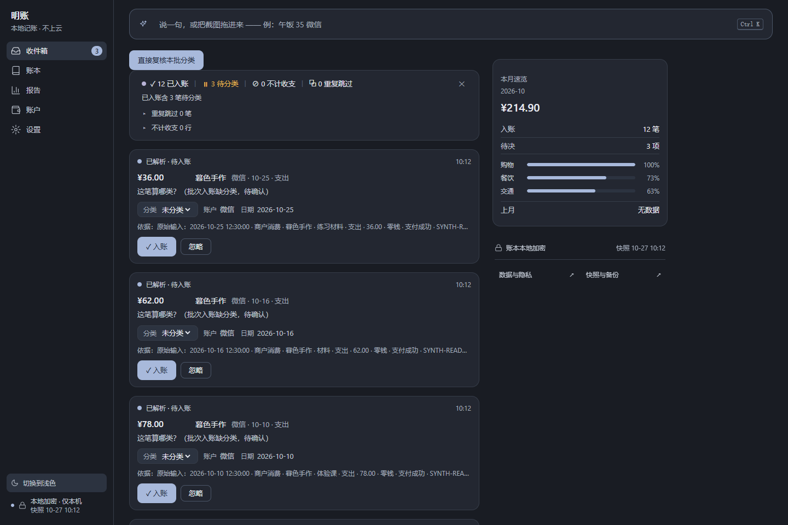
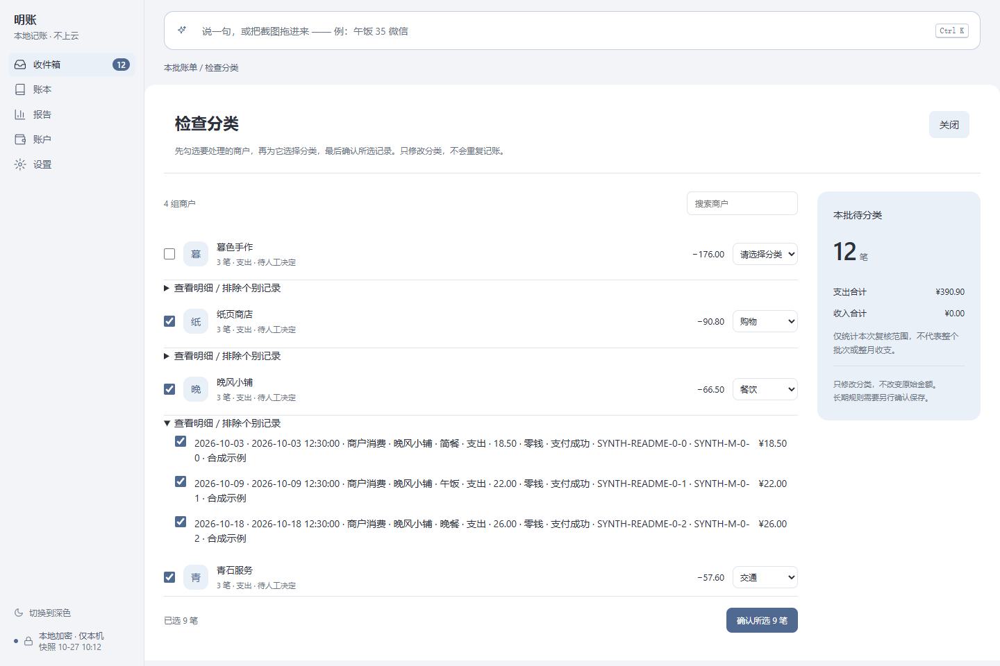
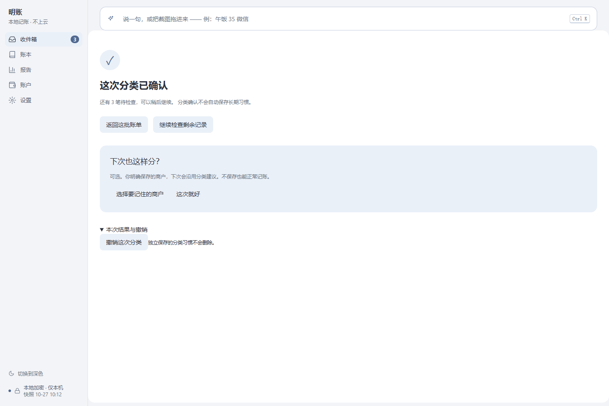
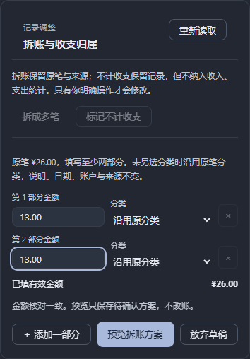
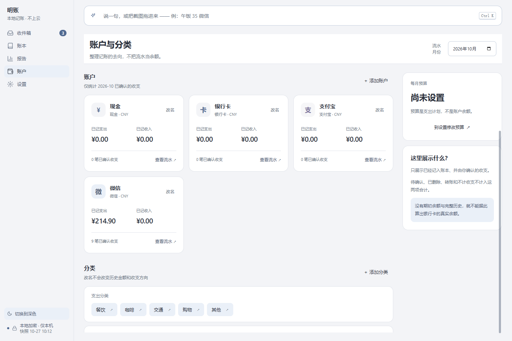
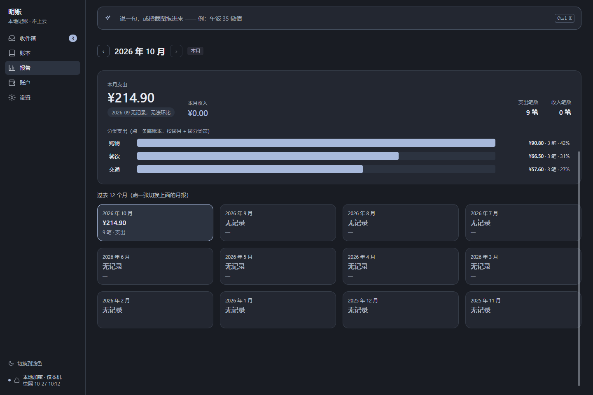

# 记账中心 · MingZhang

本地优先的 AI 记账与商品经营桌面应用，面向 Windows。既能隔一段时间集中导入账单、把分类和疑点整理清楚，也能一句话或一张截图记一笔；商品经营按多规格独立核算售价、成本与库存，卖出时锁成本，赚了多少当场算清。

仓库名仍是 `mingzhang`，程序名与安装包已改为 `jizhangzhongxin` / 记账中心。**账本数据目录保持 `%APPDATA%\mingzhang` 不变**，老账本不需要迁移。

账本保存在本机。**启用云端模型后，你交给它的文本、图片，以及工具返回的账单内容或查询结果，会发送给所选模型供应商。** 本地存储不等于所有处理都离线，详见[数据与隐私](#数据与隐私)。



以下截图均来自真实 Electron 窗口，使用隔离账本和内置离线演示。商户、金额、日期和单号全部为合成示例，不是设计稿，也不是用户账目。截图拍摄于「奶油治愈风」改版之前，页面结构、按钮位置和文案未变，配色与圆角已在该次改版中更新。

## 导入之后，把账整理清楚

导入完成不代表每笔账都已经确认。记账中心把剩下的事留在界面上：哪些已处理、哪些疑似重复、哪些缺信息、哪些不计收支，都能继续查看。

1. **导入并确认批次。** 拖入 CSV / XLSX，检查读表方案。缺方向、日期或账户等必要信息的原行会留作待办，补齐后继续处理，不另造一笔代替原行。
2. **按商户复核分类。** 有依据的建议先填好，拿不准的留白。可以展开逐笔明细、排除个别记录，也可以只确认选中的一部分。
3. **查看结果，必要时撤销。** 分类确认只处理所选记录，不重复记账。离开页面或重启后，可以继续查看本批结果及尚未完成的部分。
4. **决定要不要记住。** 确认分类不会自动保存长期习惯。“下次也这样分”需要另外选择、保存；不保存也能正常记账。





这组合成示例共有 12 笔流水，只确认其中 9 笔，另外 3 笔仍待分类；没有自动保存任何商户习惯。

## 还能做什么

- **单笔速记与截图记账：** 解析结果先待确认，补齐必要信息后由你入账；高置信度和分类习惯命中都不代替这次确认。
- **账本筛选与纠错：** 按月份、类型、分类、账户、金额、状态或关键词查找，编辑金额、日期、收支类型、分类和账户。
- **拆账与不计收支：** 拆账分项必须与原金额核对一致，先预览方案，再由界面确认；保留原笔和来源，可撤销整组拆账。不计收支保留记录，也可以恢复计入。
- **交易附件：** 在本机查看、添加、移除和预览同一笔交易的多张图片；这类附件管理不会自动把图片重新发给模型。
- **账户与分类管理：** 新建、改名，查看各账户已确认的月度收支，跳转到对应流水。这里展示的是已记流水，不是银行卡余额。
- **报告与预算：** 按月看收支、分类分布和历史月份，点分类继续查账；预算是支出计划，不是账户余额。
- **助手与历史：** 问账、查看工具执行结果、生成批量分类或拆账方案；保留当前会话历史，支持重新读取与恢复。
- **快照和恢复：** 本地快照、口令备份包、恢复检查与异常启动出口。重要数据仍应另做备份，不把程序校验当作永不出错的保证。

<details>
<summary>查看拆账、账户和月报实拍</summary>

拆账草稿中的金额会先与原笔核对；预览和最终确认是分开的动作。下图是实际详情组件的原始元素截图。







</details>

## 商品经营：多规格、加权成本、成本快照

「经营」是独立于个人账本的一层，记的是买卖本身，不是自己的开销。

- **商品固定，规格自由。** 内置 6 个商品（MUFY 猫粮 / 月卡、Rubii 账号 / 300宝石 / 月卡、LM 100币），**不预置任何规格**；规格名、售价、单件成本、库存全由你自己填，可随时增删改。
- **每个规格独立核算。** 同一商品下不同规格各有各的售价、成本、库存与累计；商品层数字恒等于各规格之和，汇总只做全量重算，不做增量累加，避免长期漂移。
- **进货按加权平均成本。** `(原库存成本 + 本次进货金额) / (原库存数量 + 本次进货数量)`，每次进货都留原成本、原库存与新成本，事后可回溯。
- **销售锁成本快照。** 成交时把该规格当时的平均成本写进订单；之后再进货、再改成本，都不会回头改写历史订单的利润。
- **退款关联原订单。** 支持全额 / 部分 / 多次，累计退款不得超过可退金额；不选原订单的手动退款单独标记。
- **库存与单件成本可以直接改。** 期初建账、私盘对账、手工发货这类情况不必硬走一遍进货流程；保存时自动保证「库存成本 = 库存数量 × 单件成本」。累计进货与累计销售是历史事实，手工校准不会动它们，也不会改旧订单的成本快照。
- **一条录入，全表联动。** 销售 / 进货 / 退款 / 客服收入 / 其他收支 / 经营支出提交后，规格、商品、看板与报表同步更新，不需要手动刷新。

渠道是固定枚举，避免同一笔钱记到不同名字下：收入为微信 / 支付宝 / 小红书千帆，支出为微信 / 支付宝，退款为微信 / 支付宝 / 小红书；经营支出分商品采购、平台费用、运营费用、人工费用、其他费用五类。

| 板块 | 内容 |
| --- | --- |
| 首页 | 今日经营、本月汇总、近 6 月净利润趋势、商品表现、快捷记账入口 |
| 经营概览 | 今日快照、商品盈亏、渠道收支 |
| 月度报表 | 每日净销售、商品排行、收入渠道占比、支出分类占比、明细 |
| 盈亏测算 | 按数量与单价实时算毛利，只算不落库 |
| 商品规格 | 行内改名称 / 售价 / 单件成本 / 库存，展开可看每个规格的累计 |
| 快捷模板 | 常用记账组合，点一下带出表单，仍需你自己提交 |
| 备份导出 | 本地快照（保留 10 份）、经营报表导出 Excel（多工作表） |

## 桌面体验

- **深浅两套主题。** 浅色是奶油白底配燕麦卡片与鼠尾草绿，深色为暖褐夜调而非冷蓝黑；两套的正文对比度都按 WCAG AA 校准，11px 小字另用加深色，避免柔和的语义色在小字号上糊成一片。
- **窗口自适应。** 1366 到 2560 逐级放大字号与内边距，而不是把内容整体拉宽；取消固定宽度后不再出现「窗口放大了、内容还挤在左半边」。
- **托盘驻留。** 点关闭按钮默认收进系统托盘继续运行，托盘菜单可重开窗口、重启本地模型、查看模型服务状态或完全退出。
- **本地模型托管。** 启动时自动拉起 Ollama，拉起失败不影响记账，只影响 AI 对话；若你已有独立启动的实例，检测到在跑就不再重复拉起。

## 模型负责判断，程序负责搬运

导入 CSV / XLSX 时，模型判断列的含义、排除条件和分类建议；程序从原表读取金额与日期、去重、核对笔数并落库。原表金额不靠模型逐行复述。

批次方案必须满足：

```text
材料行数 = 将入账 + 重复跳过 + 待核对 + 不计收支
```

截图没有原表单元格可供程序复读，金额仍依赖视觉模型识别，所以需要在确认前核对。程序约束能防止一部分搬运和执行错误，不能保证模型理解正确。

Agent 只接入 16 个账务工具，没有 shell、任意文件读写或网页访问工具。模型发起的删除、批量入账、拆账等动作要经过对应的界面确认；模型自己说“用户已确认”不算授权。

分类习惯在 **设置 → 分类习惯** 中管理，只影响后续建议，不追改历史账目。

## 从源码运行

需要 Windows 和 **Node.js ≥ 22.12**，推荐使用 Node.js 24 LTS。

```bash
git clone https://github.com/LesterChlo/mingzhang.git
cd mingzhang
npm ci
npm run dev
```

首次启动可以先选离线演示，不需要 API Key。它是本机 loopback 服务提供的**确定性假模型**，只覆盖预置规则和样例，不是本地大模型，也不能代表真实模型的理解能力。

处理自己的文本或截图前，可在 **设置 → 模型服务** 添加预设、填写模型服务并测试连接。支持多个预设及自定义端点；截图解析需要支持视觉并通过相应自检的模型，当前没有本地 OCR 兜底。

## 测试与构建

```bash
npm run typecheck   # main / web 两套 TypeScript 检查
npm test            # Vitest，默认文件并行
npm run build       # 构建 main / preload / renderer
npm run ui-test     # 构建后驱动真实 Electron 窗口
npm run dist        # Windows x64：NSIS 安装包与便携 zip，输出至 release/
```

2026-11-26 的变更记录：**144 个单测文件、1177 项测试通过；`npm run typecheck` 的 main / web 两套均无错。** 本轮只构建了 Windows 目录版（`electron-builder --win dir`），未重新生成 NSIS 安装包与便携 zip，需要出包时用 `npm run dist`。

UI 巡检走真实 preload / IPC；数据目录和 Chromium profile 成对隔离，使用合成材料。离线演示测试验证管线、确认门和界面行为，不等于测过所有真实模型。本轮界面改版以逐页截图核对为主（1366 / 1600 / 1920 / 2560 四档分辨率、深浅两套主题），`npm run ui-test` 的全量窗口巡检未重跑。GitHub CI 分别运行 `check-and-test` 与 Windows `ui-test`，结果见 [Actions](https://github.com/LesterChlo/mingzhang/actions)。

## 技术实现

| 层 | 实现 |
| --- | --- |
| 桌面与构建 | Electron 44、electron-vite、electron-builder |
| 界面 | React 18、TypeScript；主题为 CSS 变量 + 作用域覆盖层 |
| 图表 | 手绘 SVG（环形 / 柱状 / 折线），不引入图表库 |
| Agent | 以 SDK 嵌入 pi，工具范围限于账务 |
| 账本 | SQLite，`better-sqlite3-multiple-ciphers` 加密 |
| 系统密钥保护 | Electron `safeStorage`，Windows 使用 DPAPI |
| 表格与测试 | SheetJS、Vitest、Playwright |

```text
src/main/       账本与经营领域、Agent、存储与 IPC
src/preload/    受限的界面调用接口
src/renderer/   收件箱、账本、报告、账户、经营、设置及助手
src/shared/     跨层类型
tests/          领域测试、集成测试与真实窗口巡检
```

## 数据与隐私

- 账本文件默认位于 `%APPDATA%\mingzhang\mingzhang.db`。打包程序旁存在可写的 `data/` 时可使用便携数据目录；开发和测试可用 `MZ_DATA_DIR` 指定独立目录。
- **加密范围要分清。** SQLite 账本加密；会话历史和附件原图是另外的本地文件，不要把“账本加密”理解成整个数据目录都加密。
- **经营数据与个人账本同库。** 商品、规格、进货、销售、退款记录与快捷模板都在同一个加密 SQLite 文件里，快照和备份包一并覆盖；成本与库存是本程序的记账口径，不是平台后台的真实库存。
- 模型 API Key 使用系统安全存储保护。数据库快照和口令备份不是完整应用目录迁移，换机需重新配置模型服务。
- **附件原图要另备份。** 数据库快照和口令备份包含交易的附件引用，不包含原图；换机时另行保存 `attachments/` 目录，不能只带走数据库。
- 应用没有内置账号或云同步。云模型可收到你提交的文本、图片，以及它通过工具请求读取的账单表头、行内容或查询结果；供应商的留存政策由其决定。
- 不想把材料发送给云端服务时，不要启用云模型；内置离线演示只连接本机服务。不要用真实账本截图制作公开演示。

## 当前边界

- 当前版本为 `0.1.0`，构建目标是 Windows x64，尚无 macOS / Linux 桌面交付。
- 构建产物未做代码签名，Windows 可能显示未知发布者或 SmartScreen 警告；这不要求你关闭安全软件。
- **商品是固定的 6 个，只能增删改规格**，不能新建或删除商品本身；这是刻意的取舍，避免商品列表随时间变成无法对账的堆。
- 关窗口默认只是收进托盘，进程还在跑；要彻底退出请用托盘菜单的「完全退出」，否则下次替换程序文件会因占用失败。
- **托盘、自动拉起 Ollama、开机自启三个开关目前只在配置文件里**（`minimizeToTray` / `autoStartOllama` / `launchAtLogin`），界面还没有开关；改完重启生效。
- **AI 对话只处理个人账本。** 助手的 16 个工具读写的都是交易流水；经营模块的销售 / 进货 / 退款 / 支出走表单录入，模型不代你落这类单据。
- 不连接银行、微信或支付宝做后台自动扣账，也不读取店铺后台；需要你提供账单文件、文本或截图。账户流水与经营库存都不能替代平台真实余额。
- 图片识别效果取决于所选视觉模型。离线演示是规则脚本，不能处理任意材料，也不能作为真实 AI 效果展示。
- 这是仍在迭代的个人记账应用，不是专业会计系统。恢复、迁移或批量调整前，先留一份可用备份。

## 许可

[MIT](LICENSE)
